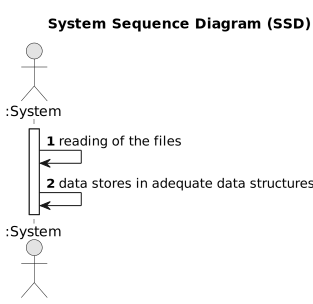

# USEI01 - File data importation

## 1. Requirements Engineering

### 1.1. User Story Description

Define the adequate data structures to store the information imported from the files.

### 1.2. Customer Specifications and Clarifications 

**From the specifications document:**

>	Each item has an id, a priority (among "HIGH", "MEDIUM" or "LOW") and a list of operations.

>	Each machine has an id, an operation associated and a specific time operation time. 

### 1.2. Acceptance Criteria

* **AC1:** All the data from files must be stored in the adequate data structures.

### 1.4. Found out Dependencies

* This has no above dependencies.

### 1.5 Input and Output Data

**Input Data:**

* .csv files

### 1.6. System Sequence Diagram (SSD)

