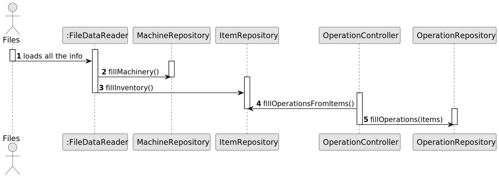

# US006 - Create a Task

## 3. Design - User Story Realization

### 3.1. Rationale

| Interaction ID | Question: Which class is responsible for...                                  | Answer                    | Justification (with patterns)                                                                                                                                                                                                                                                                        |
|:---------------|:-----------------------------------------------------------------------------|:--------------------------|:-----------------------------------------------------------------------------------------------------------------------------------------------------------------------------------------------------------------------------------------------------------------------------------------------------|
| Step 1  		     | 	... loading the information from files?                                     | FileDataReader            | The FileDataReader follows the Data Access Object (DAO) pattern, abstracting file I/O operations and handling low-level interactions with the file system. Its sole responsibility is to read raw data from files.                                                                                   |
| Step 2	        | 	... saving the info from files (related to machines)?                       | MachineRepository         | According to the Repository pattern, MachineRepository acts as the data persistence layer for Machine objects. It handles saving machine-related information to files or databases, encapsulating the data storage logic.                                                                            |
| Step 3		  		   | 	... saving the info from files (related to items)?                          | ItemRepository            | Similar to MachineRepository, the ItemRepository is responsible for persisting data for Item entities. It follows the Repository pattern, centralizing the logic for saving and retrieving Item information to ensure separation of concerns.                                                        |
| Step 4	  		    | ... interacting with both ItemRepository and OperationRepository?            | OperationController       | The Controller pattern is applied here. OperationController mediates between the view layer (UI) and the data (repositories). It coordinates actions that involve both ItemRepository and OperationRepository, orchestrating interactions for any operations that span across multiple repositories. |
| Step 5		  		   | ... saving the info from files, from itemRepository (related to operations)	 | OperationRepository						 | The OperationRepository adheres to the Repository pattern, managing the persistence of Operation objects. Since Operation objects are tied to Item objects, this repository ensures that the operations associated with items are saved, following the single responsibility principle.              |

### Systematization ##

Software classes (i.e. Pure Fabrication) identified:

* FileDataReader
* MachineRepository
* ItemRepository
* OperationController
* OperationRepository

## 3.2. Sequence Diagram (SD)

### Full Diagram

This diagram shows the full sequence of interactions between the classes involved in the realization of this user story.

## 3.3. Class Diagram (CD)

