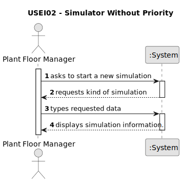

# USEI02 - Implement a simulator that processes all the items.

## 1. Requirements Engineering

### 1.1. User Story Description

Implement a simulator that processes all the items according some criteria.

### 1.2. Customer Specifications and Clarifications 

**From the specifications document:**

> Consider a factory where simple items that do not require assembly are produced; that is, simple items like chair legs and tabletops, which will be subsequently joined together or sold in that format.

> In its production, each item is subject to a set of sequential operations.

>  There may be different machines performing the same operation, possibly with different execution times. At this
stage, for simplification, a given machine only performs one operation. These stations
can be robots, automated machines, or operated by humans.

**From the client clarifications:**

> **Question:** Can an item have the same operation applied to it more than once? Or can we assume that any operation only shows once in the list?
>
> **Answer:** You can assume, at least for now, that an operation applies to an item just once.

### 1.3. Acceptance Criteria

* **AC1:** The simulator should create a preliminary queue for each operation, containing all the items, whose next operation (according to the sequential production process) is that of the specified queue.
* **AC2:** The items in the queue should be assigned based on the processing availability to the available machine capable of performing the required operation faster, in the order of their entry into the queue.

### 1.4. Found out Dependencies

* There is a dependency on "USEI01 - Store the information imported from the files" as there must be items and machines in the system to do a simulation.

### 1.5 Input and Output Data

**Input Data:**

* Typed data:
    * None.
	
* Selected data:
    * Option "Simulator Without Priority"

**Output Data:**
* Simulator execution
* List of updates, queues, status of machines and new processing.
* (In)Success of the operation.

### 1.6. System Sequence Diagram (SSD)

### 1.7 Other Relevant Remarks

* The processing time of a machine is in seconds.
* 1 second is equals to a while loop in code.
