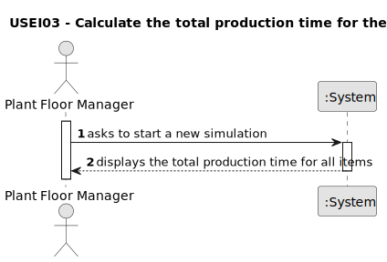

# US003 - Calculate the total production time for the items

## 1. Requirements Engineering

### 1.1. User Story Description

> As a Production Manager, I want the system to calculate the total production time for all items in a given process, so that I can have a clear understanding of the time required to complete each batch of items.

### 1.2. Customer Specifications and Clarifications 

**From the specifications document:**

> None.

**From the client clarifications:**

> **Question:**   Calculate the total production time for the items, the objetive is to calculate individually the production time for each item in the csv file, or the total operation time of all items, or the time between the start of the first machine and the end of the last one?
>
> **Answer:** the total operation time of all items but the time between the start of the first machine and the end of the last one would be nice to have. It's for each operation type (like CUT).

> **Question:** Should the output be the time that passes since the beggining of production until the end of the last operation of the last item, or the time that each item takes since its first operation to it's last to be processed?
>
> **Answer:** The time diference between the start instant and the end instant of the simulation.

### 1.3. Acceptance Criteria

* **AC1:** The total production time must be calculated and displayed in minutes.

### 1.4. Found out Dependencies

* There is a dependency on "US002 - "  " as a simulator must have been implemented.

### 1.5 Input and Output Data

**Output Data:**

* List of the total production time for all items.

### 1.6. System Sequence Diagram (SSD)

**_Other alternatives might exist._**

#### Alternative One

### 1.7 Other Relevant Remarks

* None