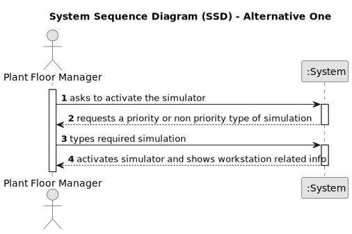

# USEI05 - Workstation Statistics

## 1. Requirements Engineering

### 1.1. User Story Description

Present a list of workstations with total time of operation, and percentages relative to the operation time and total execution time, sorted in ascending order of the percentage of execution time relative to the total time.

### 1.2. Customer Specifications and Clarifications 

**From the client clarifications:**

> **Question:** Can be more explicit when you refer "sorted in ascending order of the percentage of execution time relative to the total time.", the total time is mentioned previously as "total execution time" ?
>
> **Answer:** The goal is to show significance of each machine labour time compared to total labour of the process!
Since all machines would be shown in the list, ordering it by the percentage (significance) looks reasonable.

### 1.3. Acceptance Criteria

* **AC1:** The Simulator must fully ready so the stats can be created.

### 1.4. Found out Dependencies

* There is a dependency on "USEI02 - Implement a simulator that processes all the items according" once we have to simulate the work of all workstations to show all the info.

### 1.5 Input and Output Data

**Output Data:**

* List (in ascending order) of total time of operation, and percentages relative to the operation time and total execution time.
* (In)Success of the operation

### 1.6. System Sequence Diagram (SSD)

**_Other alternatives might exist._**

#### Alternative One

