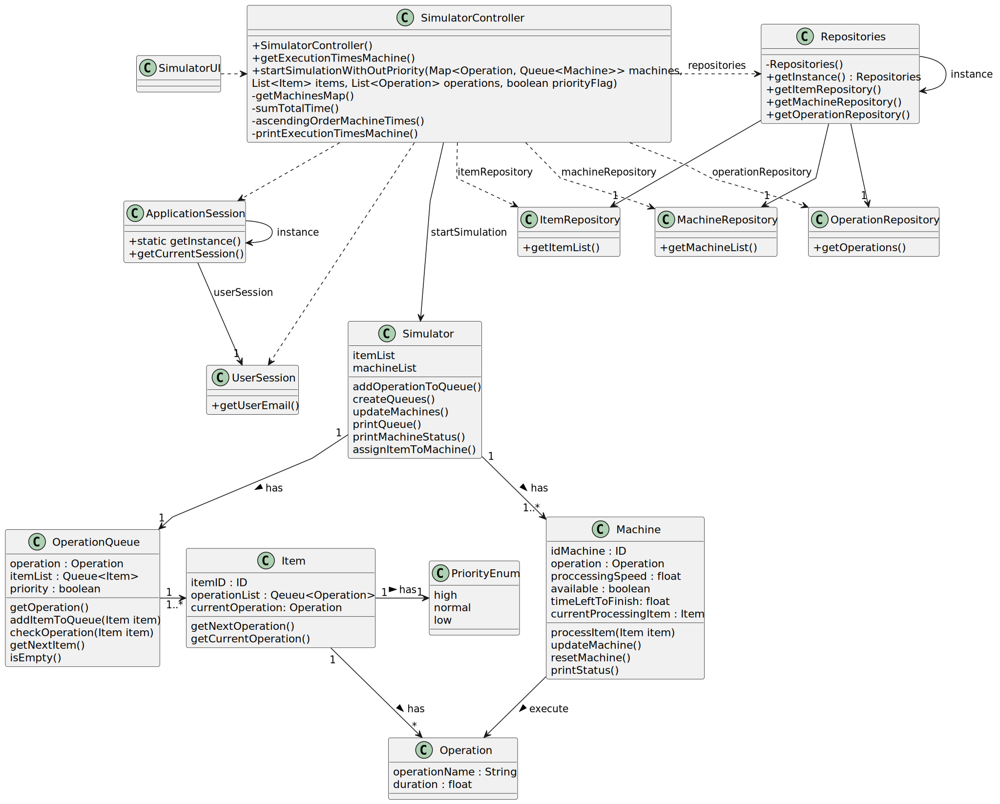

# USEI05 - Workstation Statistics

## 3. Design - User Story Realization

### 3.1. Rationale

_**Note that SSD - Alternative One is adopted.**_

| Interaction ID | Question: Which class is responsible for...              | Answer              | Justification (with patterns)                                                                              |
|:---------------|:---------------------------------------------------------|:--------------------|:-----------------------------------------------------------------------------------------------------------|
| Step 1         | ... interacting with the actor?                          | SimulatorUI         | Pure Fabrication: Responsible for interacting with the user, displaying data, and receiving inputs.        |
|                | ... coordinating the simulation execution?               | SimulatorController | Controller: Responsible for coordinating the simulation logic and interacting with repositories.           |
|                | ... obtaining the item repository instance?              | Repositories        | Creator: Repositories creates and manages access to the item repository.                                   |
|                | ... retrieving the machine list?                         | MachineRepository   | IE: MachineRepository knows and manages the list of machines.                                              |
|                | ... storing the mapping between operations and machines? | MachinesMap         | IE: MachinesMap stores the mapping between operations and machine queues.                                  |
| Step 2         | ... starting the simulation?                             | SimulatorController | Controller: The controller starts the simulation and passes the necessary configurations to the simulator. |
| Step 3         | ... creating the operation queues for the simulation?    | Simulator           | Creator: The simulator creates the operation queues based on the list of operations and items.             |
| Step 4         | ... updating the status of the machines?                 | Machine             | IE: The machine knows its own status, such as availability and time remaining to complete a task.          |
| Step 5         | ... processing an item in a machine?                     | Machine             | IE: The machine processes the items and updates its internal status.                                       |
| Step 6         | ... adding items to the operation queue?                 | OperationQueue      | IE: The operation queue knows the items and the order in which they will be processed.                     |
| Step 7         | ... assigning an item to a machine?                      | Simulator           | Controller: The simulator is responsible for distributing items to the available machines.                 |
| Step 8         | ... checking if a machine’s operation is finished?       | Machine             | IE: The machine checks its own progress and, if necessary, resets its state after finishing an operation.  |

### Systematization ##

According to the taken rationale, the conceptual classes promoted to software classes are:

* OperationQueue
* Operation
* Machine
* Item
* ID

Other software classes (i.e. Pure Fabrication) identified:

* SimulatorUI
* SimulatorController

## 3.2. Sequence Diagram (SD)

### Full Diagram

This diagram shows the full sequence of interactions between the classes involved in the realization of this user story.

## 3.3. Class Diagram (CD)

