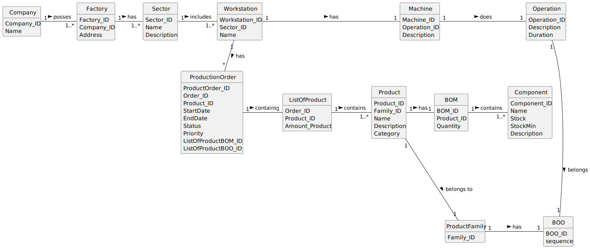

# OO Analysis

## Rationale to identify domain conceptual classes

### _Conceptual Class Category List_

**Business Transactions**

* ProductionOrder

---

**Transaction Line Itemss**

* ListOfProduct

---

**Product/Service related to a Transaction or Transaction Line Item**

* Product
* Component
* BOM (Bill of Materials)

---

**Transaction Records**

* ProductionOrder

---  

**Roles of People or Organizations**

* Company
* Costumer

---

**Places**

* Factory
* Sector
* Workstation

---

**Noteworthy Events**

* Operation

---

**Physical Objects**

* Workstation
* Components

---

**Descriptions of Things**

* Product
* Component
* Workstation

---

**Catalogs**

* ProductFamily

---

**Containers**

* BOM
* BOO

---

**Elements of Containers**

* Component
* Operation

---

**Organizations**

* Company

---

**Other External/Collaborating Systems**

* No info

---

**Records of finance, work, contracts, legal matters**

* No info

---

**Financial Instruments**

* No info

---

**Documents mentioned/used to perform some work/**

*  

---

## Rationale to identify associations between conceptual classes

An association is a relationship between instances of objects that indicates a relevant connection and that is worth of remembering, or it is derivable from the List of Common Associations:

- **_Sector_** is physically or logically part of **_Factory_**
- **_Workstation_** is physically or logically part of **_Sector_**
- **_Component_** is physically or logically part of **_Product_**
- **_ListOfProduct_** is physically or logically part of **_ProductionOrder_**

- **_BOM_** is physically or logically contained in/on **_Product_**
- **_BOO_** is physically or logically contained in/on **_ProductFamily_**

- **_Operation_** is a description for **_BOO_**
- **_Product_** is a description for **_ProductFamily_**

- **_ProductionOrder_** known/logged/recorded/reported/captured in **_Workstation_**
- **_ProductionOrder_** known/logged/recorded/reported/captured in **_Factory_**

- **_ProductionOrder_** uses or manages or owns **_ListOfProduct_**

- **_Company_** uses or manages or owns **_Factory_**
- **_Factory_** uses or manages or owns **_Sector_**

- **_Workstation_** is related with a transaction (item) of **_ProductionOrder_**
- **_BOM_** is related with a transaction (item) of **_Component_**
- **_ListOfProduct_** is related with a transaction (item) of **_Product_**

| Concept (A)     | Association |     Concept (B) |
|-----------------|:-----------:|----------------:|
| Company         |    owns     |         Factory |
| Factory         |  contains   |          Sector |
| Sector          |  includes   |     Workstation |
| Workstation     |  performs   | ProductionOrder |
| Workstation     |  executes   |       Operation |
| Operation       | belongs to  |             BOO |
| ProductFamily   |     has     |             BOO |
| Product         | belongs to  |   ProductFamily |
| Product         |     has     |             BOM |
| BOM             |  contains   |       Component |
| ListOfProduct   |  contains   |         Product |
| ProductionOrder |  contains   |   ListOfProduct |

## Domain Model

