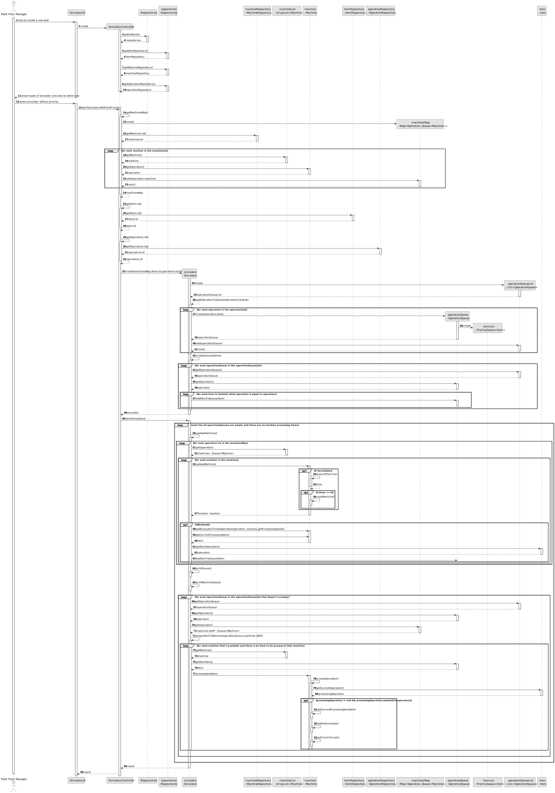
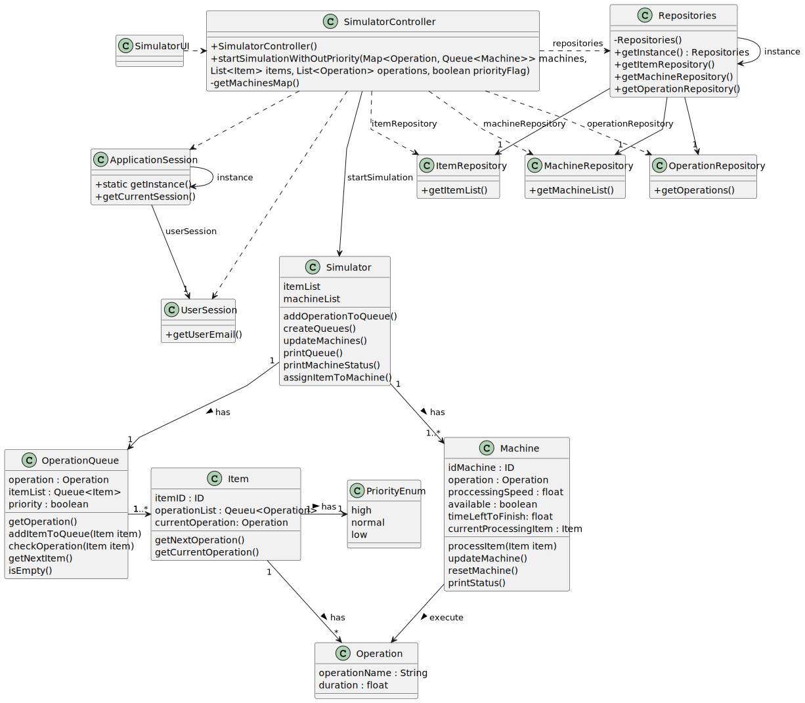

# USEI04 - Calculate execution times by each operation

## 3. Design - User Story Realization 

### 3.1. Rationale

_**Note that SSD - Alternative One is adopted.**_

| Interaction ID | Question: Which class is responsible for...           | Answer              | Justification (with patterns)                                                                      |
|:-------------  |:------------------------------------------------------|:--------------------|:---------------------------------------------------------------------------------------------------|
| Step 1  		 | 	... interacting with the actor?                      | SimulatorUI         | Pure Fabrication: Responsible for interacting with the user, displaying data, and receiving inputs |
| 			  		 | 	... coordinating the simulation?                     | SimulatorController | Controller: Responsible for coordinating the simulation logic and interacting with repositories.   |
| 			  		 | ... retrieving the operation map with their time?     | Simulator           | IE: Simulator has a map of operations with their time.                                             |
| Step 2  		 | 	...starting the simulation?		                        |   SimulatorController                  |  Controller: The controller starts the simulation and passes the necessary configurations to the simulator.                                                                                                  |
| Step 3  		 | 	...showing the operations and their respective time? | Simulator                | IE: Simulator has a map of operations with their time.                                                     |

### Systematization ##

According to the taken rationale, the conceptual classes promoted to software classes are: 

* OperationQueue
* Operation
* Simulator
* ID

Other software classes (i.e. Pure Fabrication) identified: 

* SimulatorUI

## 3.2. Sequence Diagram (SD)

### Full Diagram

This diagram shows the full sequence of interactions between the classes involved in the realization of this user story.

## 3.3. Class Diagram (CD)

