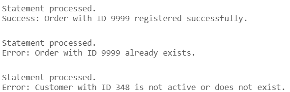

# USBD17 -  Register an order in the system

### 1. User Story Description

>  As a Production Manager, I want to register an order in the system.

### 2. Resolution
>**AC1:** Minimum expected requirement: demonstrated with data imported from the
   legacy system.
> 
>**AC2:** A function should be used to create the order, and to return
the Order ID or an error. An order must be from an active customer and a
product in the current line-up.

#### 2.1 Explanation
>This script defines a PL/SQL function called register_order, which is used to register a new order in the "Order" table. The function takes four parameters: the order ID, customer ID, delivery date, and order date. It begins by verifying if the customer is active and exists in the database. This is done by checking the Costumer table and ensuring the customer ID is not listed in the "Deactivated Costumers" table. If the customer does not exist or is inactive, the function returns an error message indicating this.
>
>If the customer is valid, the function attempts to insert the order details into the "Order" table. If the insertion is successful, it returns a success message with the order ID. The function also includes error handling for specific issues, such as trying to insert an order with a duplicate order ID, in which case it returns an error indicating the conflict. For any other errors that may occur, the function returns a generic error message containing the details of the issue. 

      CREATE OR REPLACE FUNCTION register_order (
          p_order_id "Order".ORDER_ID%TYPE,  -- Use the type of ORDER_ID column from Order table
          p_costumer_id "Order".CostumerCOSTUMER_ID%TYPE,  -- Use the type of COSTUMER_ID column
          p_delivery_date "Order".DELIVERY_DATE%TYPE,  -- Use the type of DELIVERY_DATE column
          p_order_date "Order".ORDER_DATE%TYPE,  -- Use the type of ORDER_DATE column
          p_status "Order".STATUS%TYPE  -- Use the type of STATUS column
      )
      RETURN VARCHAR2
      IS
         v_exists NUMBER(1);  -- Variable to check if the customer exists and is active
         result_message VARCHAR2(255);  -- Variable for the result message
      BEGIN
         SELECT COUNT(1)
         INTO v_exists
         FROM Costumer C
         LEFT JOIN "Deactivated Costumers" DC
         ON DC.CostumerCOSTUMER_ID = C.COSTUMER_ID
         WHERE C.COSTUMER_ID = p_costumer_id
         AND DC.CostumerCOSTUMER_ID IS NULL;
         
         IF v_exists = 0 THEN
            RETURN 'Error: Customer with ID ' || p_costumer_id || ' is not active or does not exist.';
         END IF;
      
         -- Step 2: Insert the order into the "Order" table
         BEGIN
            INSERT INTO "Order" (ORDER_ID, CostumerCOSTUMER_ID, DELIVERY_DATE, ORDER_DATE, STATUS)
            VALUES (p_order_id, p_costumer_id, p_delivery_date, p_order_date, p_status);

            -- Step 3: Return success message with the Order ID
            result_message := 'Success: Order with ID ' || p_order_id || ' registered successfully.';
            RETURN result_message;
   
         EXCEPTION
             WHEN DUP_VAL_ON_INDEX THEN
                 RETURN 'Error: Order with ID ' || p_order_id || ' already exists.';
             WHEN OTHERS THEN
                 RETURN 'Error: ' || SQLERRM;
         END;
      END;
      /
   
      DECLARE
         result_message VARCHAR2(255);
      BEGIN
         result_message := register_order(9999, 785, TO_DATE('15/09/2024', 'DD/MM/YYYY'), TO_DATE('23/09/2024', 'DD/MM/YYYY'),'Pending');
         DBMS_OUTPUT.PUT_LINE(result_message);  -- Output the result message
      END;
      /
      
      DECLARE
         result_message VARCHAR2(255);
      BEGIN
         result_message := register_order(9999, 785, TO_DATE('15/09/2024', 'DD/MM/YYYY'), TO_DATE('23/09/2024', 'DD/MM/YYYY'),'Pending');
         DBMS_OUTPUT.PUT_LINE(result_message);  -- Output the result message
      END;
      /
      
      DECLARE
         result_message VARCHAR2(255);
      BEGIN
         result_message := register_order(9999, 348, TO_DATE('15/09/2024', 'DD/MM/YYYY'), TO_DATE('23/09/2024', 'DD/MM/YYYY'),'Pending');
         DBMS_OUTPUT.PUT_LINE(result_message);  -- Output the result message
      END;
      /

### 3. Resolution

>

>[See results in a CSV file](csv_result/USBD17.csv)

