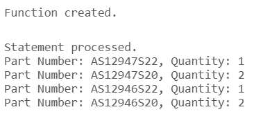

# USBD12 - List of parts used in a product

### 1. User Story Description

>  As a Production Manager, I want to get the list of parts used in a product.

### 2. Resolution
>**AC1:** Minimum expected requirement: demonstrated with data imported from the
legacy system.
> 
>**AC2:** A function should return a cursor with all the product
parts and their quantity. The individual components should be included when a
part is a subproduct made at the factory

    CREATE OR REPLACE FUNCTION list_parts_used_product(
        product_id IN Operation.BOOProductPRODUCT_ID%TYPE
    )
    RETURN SYS_REFCURSOR
    IS
        list_parts_cursor SYS_REFCURSOR;
    BEGIN
        OPEN list_parts_cursor FOR
            SELECT PartPARTNUMBER, SUM(QUANTITY) AS QUANTITY
            FROM (
                SELECT BI.PartPARTNUMBER, BI.QUANTITY
                FROM BOO_INPUT BI
                JOIN Operation O ON BI.OperationOPERATION_ID = O.OPERATION_ID
                WHERE O.BOOProductPRODUCT_ID = product_id
    
                UNION ALL

                SELECT BI.PartPARTNUMBER, BI.QUANTITY * PP.QUANTITY
                FROM BOO_INPUT BI
                JOIN (
                    SELECT O.OPERATION_ID, BI.PartPARTNUMBER, BI.QUANTITY
                    FROM BOO_INPUT BI
                    JOIN Operation O ON BI.OperationOPERATION_ID = O.OPERATION_ID
                    WHERE O.BOOProductPRODUCT_ID IN (
                        SELECT PartPARTNUMBER
                        FROM BOO_INPUT
                        WHERE OperationOPERATION_ID = O.OPERATION_ID
                    )
                ) PP ON BI.OperationOPERATION_ID = PP.OPERATION_ID
            )
            GROUP BY PartPARTNUMBER;
    
        RETURN list_parts_cursor;
    END;
    /

    DECLARE
        parts_cursor SYS_REFCURSOR;
        part_number BOO_INPUT.PartPARTNUMBER%TYPE;
        quantity     BOO_INPUT.QUANTITY%TYPE;
    BEGIN
        parts_cursor := list_parts_used_product('AS12945S22');

        LOOP
            FETCH parts_cursor INTO part_number, quantity;
            EXIT WHEN parts_cursor%NOTFOUND;
            
            DBMS_OUTPUT.PUT_LINE('Part Number: ' || part_number || ', Quantity: ' || quantity);
        END LOOP;
        
        CLOSE parts_cursor;
    END;
    /

### 3. Resolution

>

>[See results in a CSV file](csv_result/USBD12.csv)

