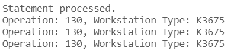

# USBD13 -  list of operations involved in the production of a product and each workstation type

### 1. User Story Description

>  As a Production Manager, I want to get a list of operations involved in the production of a product, as well as each workstation type.

### 2. Resolution
>**AC1:** Minimum expected requirement: demonstrated with data imported from the
legacy system.
> 
>**AC2:** A function should return a cursor with all product operations. When a part is a subproduct made at the factory, its list of operations
should be included. For each operation, the inputs and outputs should be included.

>This script defines a PL/SQL function called list_operations_and_workstationTypes, which returns a cursor containing a list of operations and their associated workstation types for a given product ID.The function accepts a product_id as input and opens a SYS_REFCURSOR to retrieve the relevant data.
>
>The first part of the query selects operation IDs and workstation type IDs from the Operation and Workstation_Type_Operation_TYPE tables, filtering by the product ID. It groups the results by operation ID and workstation type ID. The UNION ALL operator is then used to combine this result with a second query, which retrieves the same columns, but with a more complex join that includes the BOO_OUTPUT and BOO_INPUT tables. This part ensures that operations related to subproduct outputs are also included.
 

    CREATE OR REPLACE FUNCTION list_operations_and_workstationTypes(
        product_id IN Product.PRODUCT_ID%TYPE
    )
    RETURN SYS_REFCURSOR
    AS
        operation_worstationTypes_cursor SYS_REFCURSOR;
    BEGIN
        OPEN operation_worstationTypes_cursor FOR
            -- First part of the query: Operations and Workstation Types
            SELECT O.OPERATION_ID, WtOp.Workstation_TypeWS_TYPE_ID
            FROM Operation O
            JOIN Workstation_Type_Operation_TYPE WtOp
            ON WtOp.Operation_typeOPTYPE_ID = O.Operation_TYPEOPTYPE_ID
            WHERE O.BOOProductPRODUCT_ID = product_id
            GROUP BY O.OPERATION_ID, WtOp.Workstation_TypeWS_TYPE_ID
    
            UNION ALL
            
            -- Second part of the query: BOO_OUTPUT and Workstation Types
            SELECT O.OPERATION_ID, WtOp.Workstation_TypeWS_TYPE_ID
            FROM Operation O
            JOIN BOO_OUTPUT BO ON O.OPERATION_ID = BO.OperationOPERATION_ID
            JOIN Workstation_Type_Operation_TYPE WtOp 
                ON WtOp.Operation_typeOPTYPE_ID = O.Operation_TYPEOPTYPE_ID
            WHERE BO.PartPARTNUMBER IN (
                SELECT PartPARTNUMBER 
                FROM BOO_INPUT
                WHERE OperationOPERATION_ID IN (
                    SELECT OPERATION_ID 
                    FROM Operation 
                    WHERE BOOProductPRODUCT_ID = product_id
                )
            )
            GROUP BY O.OPERATION_ID, WtOp.Workstation_TypeWS_TYPE_ID;
    
        RETURN operation_worstationTypes_cursor;
    END;
    /

    DECLARE
        operation_workstationTypes_cursor SYS_REFCURSOR;
        op Operation.OPERATION_ID%TYPE;
        wT Workstation_Type_Operation_TYPE.Workstation_TypeWS_TYPE_ID%TYPE;
    BEGIN
        -- A99999S99, AS12945S22
        operation_workstationTypes_cursor := list_operations_and_workstationTypes('A99999S99');
    
        LOOP
            FETCH operation_workstationTypes_cursor INTO op, wT;
            EXIT WHEN operation_workstationTypes_cursor%NOTFOUND;
    
            DBMS_OUTPUT.PUT_LINE('Operation: ' || op || ', Workstation Type: ' || wT);
        END LOOP;
    
        CLOSE operation_workstationTypes_cursor;
    END;
    /

### 3. Resolution

>

>[See results in a CSV file](csv_result/USBD13.csv)

