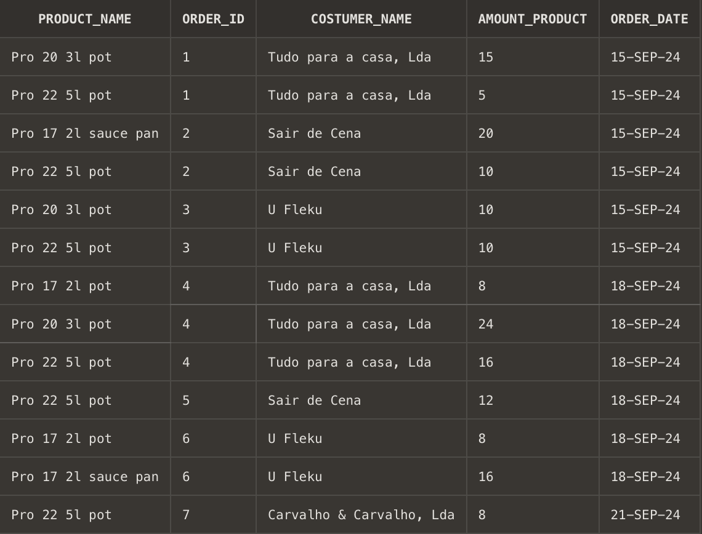

# USBD14 -  List product that uses all types of machines available in the factory

### 1. User Story Description

>  As a Plant Manager, I want to know which product uses all types of machines available in the factory.

### 2. Resolution
>**AC1:** Minimum expected requirement: demonstrated with data imported from the
   legacy system.

      CREATE OR REPLACE FUNCTION list_product_haveALL_operations
      RETURN SYS_REFCURSOR
      AS
         product_haveAll_operations_cursor SYS_REFCURSOR;
      BEGIN
         OPEN product_haveAll_operations_cursor FOR
            SELECT P.PRODUCT_ID
            FROM Product P
            JOIN Operation O ON P.PRODUCT_ID = O.BOOProductPRODUCT_ID
            GROUP BY P.PRODUCT_ID
            HAVING COUNT(O.OPERATION_ID) = (
               SELECT MAX(op_count)
               FROM (
                  SELECT COUNT(OPERATION_ID) AS op_count
                  FROM Operation
                  GROUP BY BOOProductPRODUCT_ID
               ) subquery
            );
         RETURN product_haveAll_operations_cursor;
      END;
      /
      
      DECLARE
      product_haveAll_operations_cursor SYS_REFCURSOR;
      
          p Product.PRODUCT_ID%TYPE;
      BEGIN
      product_haveAll_operations_cursor := list_product_haveALL_operations();
      
          LOOP
              FETCH product_haveAll_operations_cursor INTO p;
              EXIT WHEN product_haveAll_operations_cursor%NOTFOUND;
      
              DBMS_OUTPUT.PUT_LINE('Product: ' || p);
          END LOOP;
      
          CLOSE product_haveAll_operations_cursor;
      END;
      /

### 3. Resolution

>

>[See results in a CSV file](csv_result/USBD14.csv)

