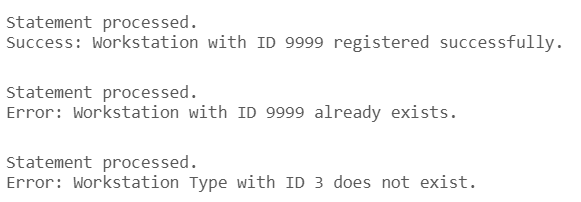

# USBD15 -  Register a workstation in the system

### 1. User Story Description

>  As a Plant Floor Manager, I want to register a workstation in the system

### 2. Resolution
>**AC1:** Minimum expected requirement: demonstrated with data imported from the
   legacy system.
> 
>**AC2:** Acceptance criteria: A function should be used to create the workstation and
to return success or an error.

      CREATE OR REPLACE FUNCTION register_workstation (
         p_ws_id Work_Station.WS_ID%TYPE, 
         p_ws_type_id Workstation_Type.WS_TYPE_ID%TYPE, 
         p_name Work_Station.NAME%TYPE,
         p_description Work_Station.DESCRIPTION%TYPE 
      )
      RETURN VARCHAR2
      AS
         result_message VARCHAR2(255);
         v_exists NUMBER(1);
      BEGIN
         SELECT COUNT(1)
         INTO v_exists
         FROM Workstation_Type
         WHERE WS_TYPE_ID = p_ws_type_id;
   
         IF v_exists = 0 THEN
            RETURN 'Error: Workstation Type with ID ' || p_ws_type_id || ' does not exist.';
         END IF;
   
         BEGIN
            INSERT INTO Work_Station (WS_ID, Workstation_TypeWS_TYPE_ID, NAME, DESCRIPTION)
            VALUES (p_ws_id, p_ws_type_id, p_name, p_description);
      
            result_message := 'Success: Workstation with ID ' || p_ws_id || ' registered successfully.';
            RETURN result_message;
      
         EXCEPTION
             WHEN DUP_VAL_ON_INDEX THEN
                 RETURN 'Error: Workstation with ID ' || p_ws_id || ' already exists.';
             WHEN OTHERS THEN
                 RETURN 'Error: ' || SQLERRM;
         END;
      END;
      /
   
   
      DECLARE
         result_message VARCHAR2(255); -- Variable to store the output message
      BEGIN
         result_message := register_workstation (9999, 'A4578', 'Test', 'ID test.');
         DBMS_OUTPUT.PUT_LINE(result_message);
      END;
      /

### 3. Resolution

>

>[See results in a CSV file](csv_result/USBD015.csv)

