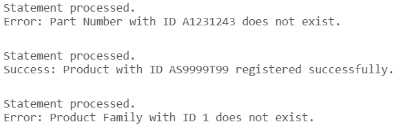

# USBD16 -  Register a product in the system

### 1. User Story Description

>  As a Production Manager, I want to register a product in the system.

### 2. Resolution
>**AC1:** Minimum expected requirement: demonstrated with data imported from the
   legacy system.
> 
>**AC2:** A function should be used to create the product and to return success or an error.

      CREATE OR REPLACE FUNCTION register_product (
          p_product_id Product.PRODUCT_ID%TYPE,  
          p_prod_family_id Product.Prod_FamilyFAMILY_ID%TYPE, 
          p_name Product.NAME%TYPE,  
          p_description Product.DESCRIPTION%TYPE,  
          p_partnumber Product.PartPARTNUMBER%TYPE 
      )
      RETURN VARCHAR2
      IS
         v_exists NUMBER(1); 
         result_message VARCHAR2(255);  
      BEGIN
         SELECT COUNT(1)
         INTO v_exists
         FROM Prod_Family
         WHERE FAMILY_ID = p_prod_family_id;
      
         IF v_exists = 0 THEN
             RETURN 'Error: Product Family with ID ' || p_prod_family_id || ' does not exist.';
         END IF;
   
         BEGIN
             INSERT INTO Product (PRODUCT_ID, Prod_FamilyFAMILY_ID, NAME, DESCRIPTION, PartPARTNUMBER)
             VALUES (p_product_id, p_prod_family_id, p_name, p_description, p_partnumber);
      
             result_message := 'Success: Product with ID ' || p_product_id || ' registered successfully.';
             RETURN result_message;
      
         EXCEPTION
             WHEN DUP_VAL_ON_INDEX THEN
                 RETURN 'Error: Product with ID ' || p_product_id || ' already exists.';
             WHEN OTHERS THEN
                 RETURN 'Error: ' || SQLERRM;
         END;
      END;
      /
   
   
      DECLARE
         result_message VARCHAR2(255);
      BEGIN
         result_message := register_product('AS9999T99', 130,'TESTE', 'TESTE', NULL);
         DBMS_OUTPUT.PUT_LINE(result_message);  -- Output the result message
      END;
      /

### 3. Resolution

>

>[See results in a CSV file](csv_result/USBD16.csv)

