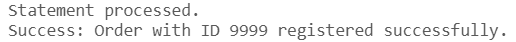

# USBD17 -  Register an order in the system

### 1. User Story Description

>  As a Production Manager, I want to register an order in the system.

### 2. Resolution
>**AC1:** Minimum expected requirement: demonstrated with data imported from the
   legacy system.
> 
>**AC2:** A function should be used to create the order, and to return
the Order ID or an error. An order must be from an active customer and a
product in the current line-up.

      CREATE OR REPLACE FUNCTION register_order (
         p_order_id "Order".ORDER_ID%TYPE, 
         p_costumer_id "Order".CostumerCOSTUMER_ID%TYPE,  
         p_delivery_date "Order".DELIVERY_DATE%TYPE,  
         p_order_date "Order".ORDER_DATE%TYPE 
      )
      RETURN VARCHAR2
      IS
         v_exists NUMBER(1); 
         result_message VARCHAR2(255);  
      BEGIN
         SELECT COUNT(1)
         INTO v_exists
         FROM Costumer C
         LEFT JOIN "Deactivated Costumers" DC
         ON DC.CostumerCOSTUMER_ID = C.COSTUMER_ID
         WHERE C.COSTUMER_ID = p_costumer_id
         AND DC.CostumerCOSTUMER_ID IS NULL;
         
          IF v_exists = 0 THEN
              RETURN 'Error: Customer with ID ' || p_costumer_id || ' is not active or does not exist.';
          END IF;

          BEGIN
              INSERT INTO "Order" (ORDER_ID, CostumerCOSTUMER_ID, DELIVERY_DATE, ORDER_DATE)
              VALUES (p_order_id, p_costumer_id, p_delivery_date, p_order_date);
      
              result_message := 'Success: Order with ID ' || p_order_id || ' registered successfully.';
              RETURN result_message;

          EXCEPTION
              WHEN DUP_VAL_ON_INDEX THEN
                  RETURN 'Error: Order with ID ' || p_order_id || ' already exists.';
              WHEN OTHERS THEN
                  RETURN 'Error: ' || SQLERRM;
          END;
      END;
      /
      
      
      DECLARE
         result_message VARCHAR2(255);
      BEGIN
         result_message := register_order(9999, 785, TO_DATE('15/09/2024', 'DD/MM/YYYY'), TO_DATE('23/09/2024', 'DD/MM/YYYY'));
         DBMS_OUTPUT.PUT_LINE(result_message);  -- Output the result message
      END;
      /

### 3. Resolution

>

>[See results in a CSV file](csv_result/USBD17.csv)

