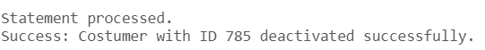

# USBD18 -  Deactivate a customer from the system

### 1. User Story Description

>  As a Production Manager, I want to deactivate a customer from the
system

### 2. Resolution
>**AC1:** Minimum expected requirement: demonstrated with data imported from the
   legacy system.
> 
>**AC2:** A function should be used to deactivate the customer
and return success or an error. A customer with orders that have not yet been
delivered/fulfilled cannot be deactivated.

#### 2.1 Explanation
> This script defines a PL/SQL function called deactivate_costumer, which deactivates a customer based on their ID if certain conditions are met. The function first checks if the customer exists in the Costumer table. If the customer does not exist, it returns an error message indicating that. It also checks whether the customer has any active orders in the "Order" table that are not delivered. If such orders exist, the function returns an error message stating that the customer cannot be deactivated due to active orders.
>
>If the customer exists and has no active orders, the function attempts to deactivate the customer by inserting their ID into the "Deactivated Costumers" table. Upon successful deactivation, it returns a success message. The function includes error handling to roll back the transaction if any issues arise during the deactivation process, ensuring database consistency. It also returns an error message detailing the cause of the failure if something goes wrong.

      CREATE OR REPLACE FUNCTION deactivate_costumer(p_costumer_id Costumer.COSTUMER_ID%TYPE)
      RETURN VARCHAR2
      IS
         v_exists NUMBER(1);  -- Variable to check if the customer exists and is active
         result_message VARCHAR2(255);
      BEGIN
         -- Check if the customer exists
         SELECT COUNT(1)
         INTO v_exists
         FROM Costumer C
         WHERE C.COSTUMER_ID = p_costumer_id;
      
         IF v_exists = 0 THEN
             RETURN 'Error: Customer with ID ' || p_costumer_id || ' does not exist.';
         END IF;
      
         -- Check if there are any active orders that are not delivered
         SELECT COUNT(1)
         INTO v_exists
         FROM "Order" O
         WHERE O.CostumerCOSTUMER_ID = p_costumer_id AND O.STATUS NOT LIKE 'Delivered';
      
         IF v_exists > 0 THEN
             RETURN 'Error: Customer with ID ' || p_costumer_id || ' has active orders.';
         END IF;
      
         -- Try to deactivate the customer
         BEGIN
             -- Insert into the Deactivated Costumers table
             INSERT INTO "Deactivated Costumers"(CostumerCOSTUMER_ID) VALUES (p_costumer_id);
      
             -- Commit transaction (if auto-commit is not enabled in your environment)
             COMMIT;
      
             -- Success message
             result_message := 'Success: Customer with ID ' || p_costumer_id || ' deactivated successfully.';
             RETURN result_message;
      
         EXCEPTION
             WHEN OTHERS THEN
                 -- Rollback in case of error
                 ROLLBACK;
                 RETURN 'Error: ' || SQLERRM;
         END;
      END;
      /
      
      
      DECLARE
         result_message VARCHAR2(255);
      BEGIN
         result_message := deactivate_costumer(1);
         DBMS_OUTPUT.PUT_LINE(result_message);
      END;
      /
      
      DECLARE
         result_message VARCHAR2(255);
      BEGIN
         result_message := deactivate_costumer(785);
         DBMS_OUTPUT.PUT_LINE(result_message);
      END;
      /
      
      DECLARE
         result_message VARCHAR2(255);
      BEGIN
         result_message := deactivate_costumer(348);
         DBMS_OUTPUT.PUT_LINE(result_message);
      END;
      /

### 3. Resolution

>

>[See results in a CSV file](csv_result/USBD18.csv)

