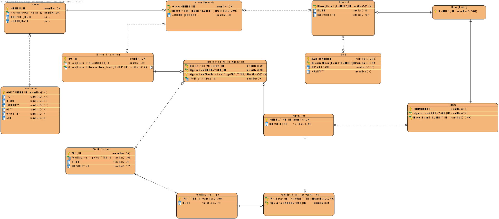
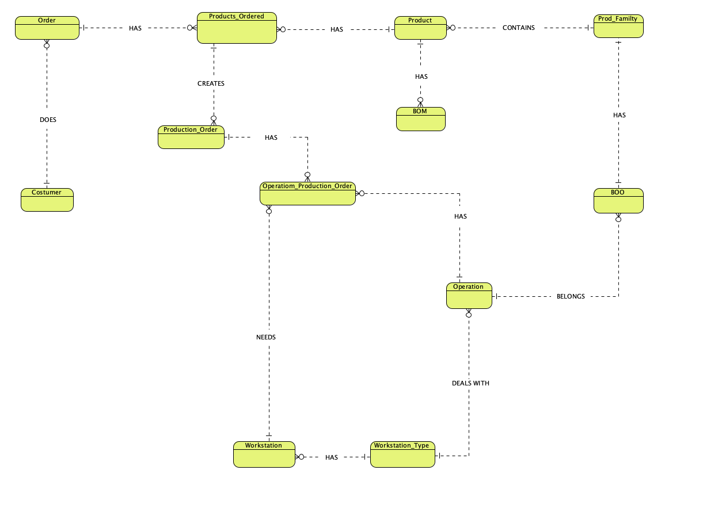

# USBD02 - Relational model (logical level).

### 1. User Story Description

> As a Product Owner, I want the relational model to be created (logical level).

### 2. Customer Specifications and Clarifications

> **Question nº1:** Uma vez que no enunciado do projeto fala em produtos terem variantes que diferem em tamanho e cores, fiquei confuso com a frase anterior. É suposto considerar parametros como tamanho e cores em Produto sendo esses variante da Familia de Produtos? Ou haver Familia de Produtos, Produto e ainda Variante do Produto?
>
> **Answer:** Para tornar a coisa minimamente gerível, considera-se que um produto é uma variante de uma família de produtos, porque tem algo que o diferencia do resto da família (tamanho, material, cor, etc.).

> **Question nº2:** Good Afternoon! In the Dataset in the table BOM there are two collumns called part number and description. Is the description refering to the part number? Thanks!
>
> **Answer:** Yes.

### 3. Acceptance Criteria

* **AC1:** The data model should cover the industrial facility’s activity described in the
  document, as well as any additional requirements resulting from the provided
  user stories.

>* **AC2:** Minimum expected requirement: a complete model in Visual Paradigm, including all connections and constraints, which allows the physical model
   script to be automatically generated.
>#### Relational Model - (Logical Model)
>

>* **AC3:** Minimum requirement above the expected: the presentation of a conceptual
   model developed in Visual Paradigm in addition to the expected level.
>#### Relational Model - (Conceptual Model)
>

