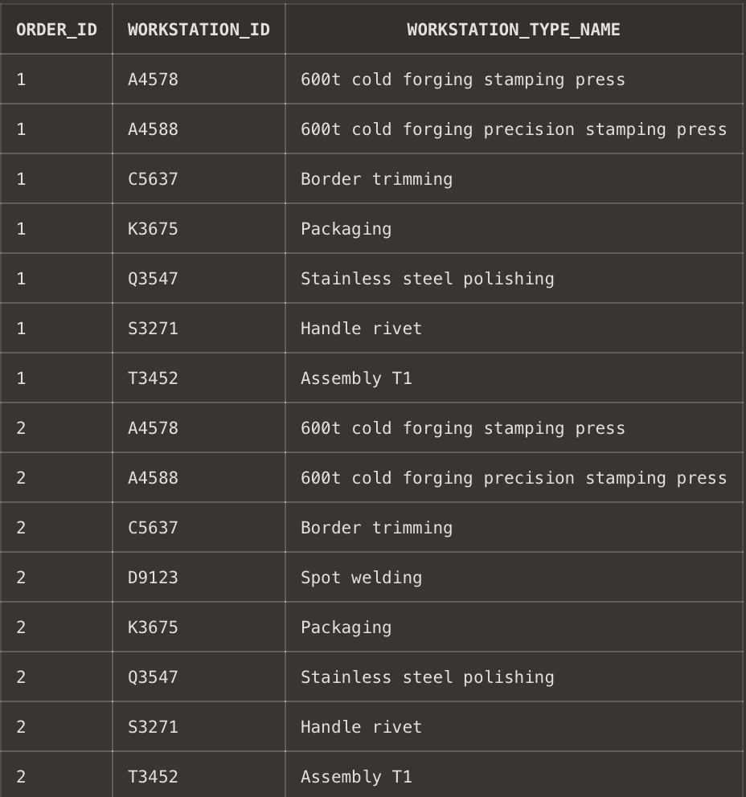
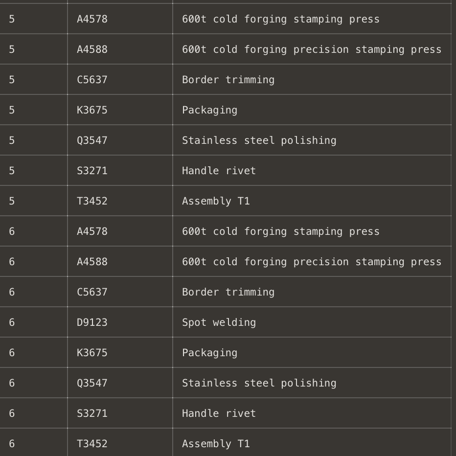
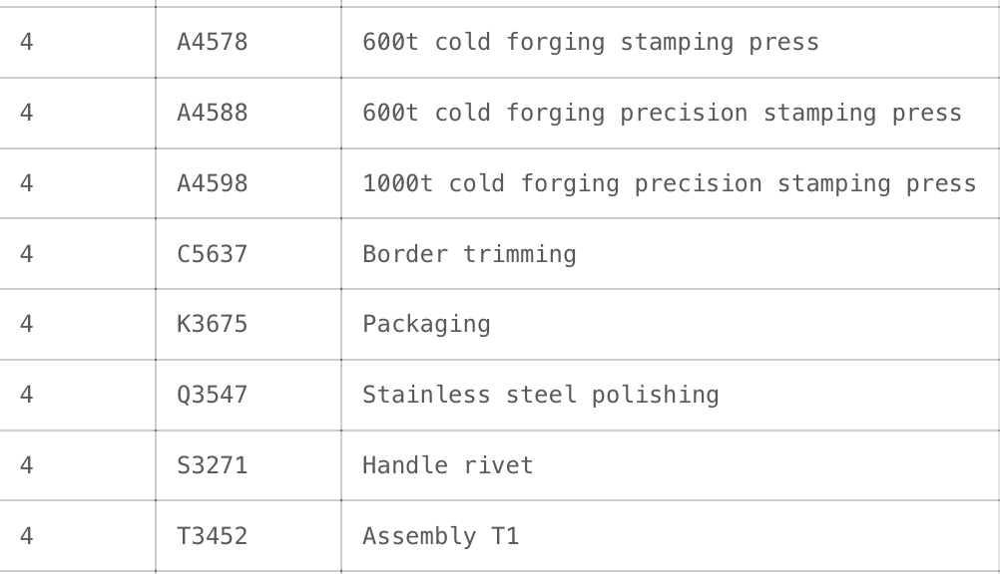

# USBD06 -  View Workstation Types Used in Orders

### 1. User Story Description

> As a Production Manager, I want to know the types of workstations used in a given order.

### 2. Customer Specifications and Clarifications

> **Question nº1:**
As a Production Manager, I want to know the types of workstations used in a given order.
This "order" means in a given sequence, or a order of products?
>
> **Answer:**
Order means the business entity "Order".

### 3. Resolution

>**AC1:** Minimum expected requirement: demonstrated with data imported from the
legacy system.

    select  o.ORDER_ID as Order_ID, wt.WS_TYPE_ID as Workstation_ID, wt.NAME as Workstation_Type_Name
    from "Order" o, Order_Products op, Product p, Prod_Family pf, BOO b, Operation op, Workstation_Type wt, Work_Station w, Costumer c, Workstation_Type_Operation wto
    where p.Prod_FamilyFAMILY_ID = pf.FAMILY_ID
    and op.ProductPRODUCT_ID =  p.PRODUCT_ID
    and op.OrderORDER_ID = o.ORDER_ID
    and o.CostumerCOSTUMER_ID = c.COSTUMER_ID
    and b.Prod_FamilyFAMILY_ID = pf.FAMILY_ID
    and b.OperationOPERATION_ID = op.OPERATION_ID
    and wto.OperationOPERATION_ID = op.OPERATION_ID
    and wto.Workstation_TypeWS_TYPE_ID = wt.WS_TYPE_ID
    and w.Workstation_TypeWS_TYPE_ID = wt.WS_TYPE_ID
    group by o.ORDER_ID, wt.WS_TYPE_ID, wt.NAME
    order by o.ORDER_ID asc;

### 4. Results

>
>
>
>
>
>
>

>[See results in a CSV file](csv_result/USBD06.csv)

