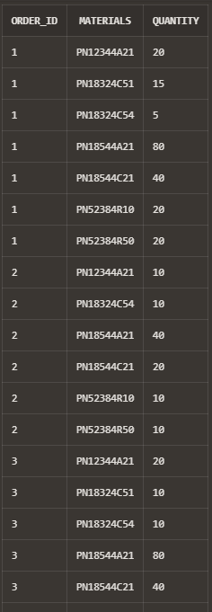
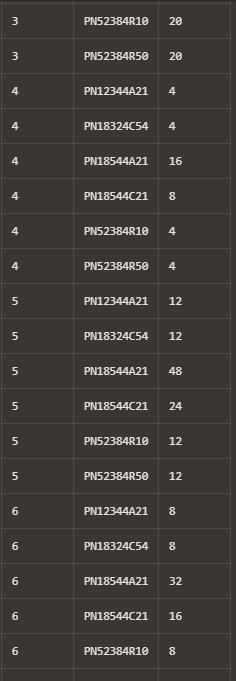
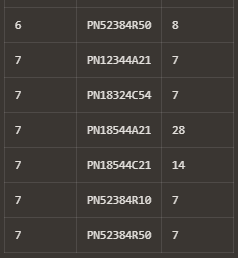

# USBD07 - Show Operations.

### 1. User Story Description

> As a Production Manager, I want to know the materials/components
to be ordered to fulfill a given production order, including the quantity of each
material/component.

### 2. Customer Specifications and Clarifications

> None.

### 3. Acceptance Criteria

* **AC1:** Minimum acceptance criteria: only the User Stories with data allowing their
  proper functioning will be evaluated.
* **AC2:** Minimum expected requirement: demonstrated with data imported from the
  legacy system.
* **AC3:** Minimum requirement above the expected: demonstrated with data provided
  for Sprint 1 evaluation.

### 4. Result

    select o.ORDER_ID, b.PARTNUMBER as Materials, sum(b.QUANTITY * op.AMOUNT_PRODUCT) as Quantity
    from "Order" o, Order_Products op, Product p, BOM b
    where
    op.OrderORDER_ID = o.ORDER_ID
    and op.ProductProd_FamilyFAMILY_ID = p.Prod_FamilyFAMILY_ID
    and b.ProductProd_FamilyFAMILY_ID = p.Prod_FamilyFAMILY_ID
    group by o.ORDER_ID, b.PARTNUMBER
    order by o.ORDER_ID;

>
>
>
> 
>[See results in a CSV file](csv_result/USBD07.csv)

